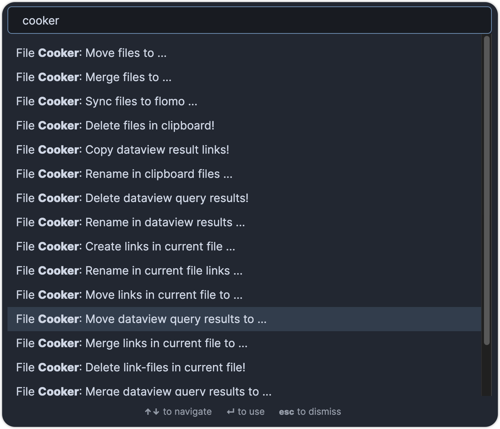

> 欢迎加微讨论：SuppleThinking

> [中文文档](README_zh.md)

# obsidian-file-cooker

This plugin for Obsidian deals multi notes from search results、current file、Dataview query string...
    
## Features

- Add Multi-File to target Canvas --- **New in v1.7.0**
- Add text to target Canvas---**New in v1.7.6**
- Add Dataview Task to target Canvas---**New in v1.7.7**
- Move/Copy Multi-File to target folder
- Rename Multi-File
- Add or Change Multi-File's Props（need to install **MetaEdit** plugin）
- Delete Multi-File
- Merge Multi-File to target file
- Create files from unresolved links
- Sync Multi-File to flomo
- Copy Dataview result links to clipboard(DataviewJS pages queries is supported since **v1.7.1**))

> - files from clipboard
> - file links in current file
> - files from dataview query（need to install **dataview** plugin）

## Usage

- **Select**:Select at least one file you want to cook
- **Cook**:Execute target command(e.g. Move/Copy, Delete ...)
- **Confirm**:Confirm execution

### Select

Support 3 selects ways：
- Copy file links to clipboard. e.g. Copy obsidian search results
- Content or links in current file
- Dataview search command/DataviewJS pages queries(**New in v1.7.1**)

### Cook

Depends on the different way to select, execute a different command.Ensure:
- Copy before executing deal-with-clipboard command.
- Open file before executing deal-with-current-file command.
- Selected Dataview-Command before executing deal-with-dataview command

### Confirm

All commands open a popup to be confirmed.

## How to install

### From within Obsidian
You can activate this plugin within Obsidian by doing the following:
- Open Settings > Third-party plugin
- Make sure Safe mode is off
- Click Browse community plugins
- Search for "File Cooker"
- Click Install
- Once installed, close the community plugins window and activate the newly installed plugin

### Manual installation

- Download the [latest release](https://github.com/ivaneye/obsidian-files-cooker/releases/latest)
- Extract the obsidian-file-cooker folder from the zip to your vault's plugins folder: `<vault>/.obsidian/plugins/`  
Note: On some machines the `.obsidian` folder may be hidden. On MacOS you should be able to press `Command+Shift+Dot` to show the folder in Finder.
- Reload Obsidian
- If prompted about Safe Mode, you can disable safe mode and enable the plugin.

# Buy me a coffee

  
  

