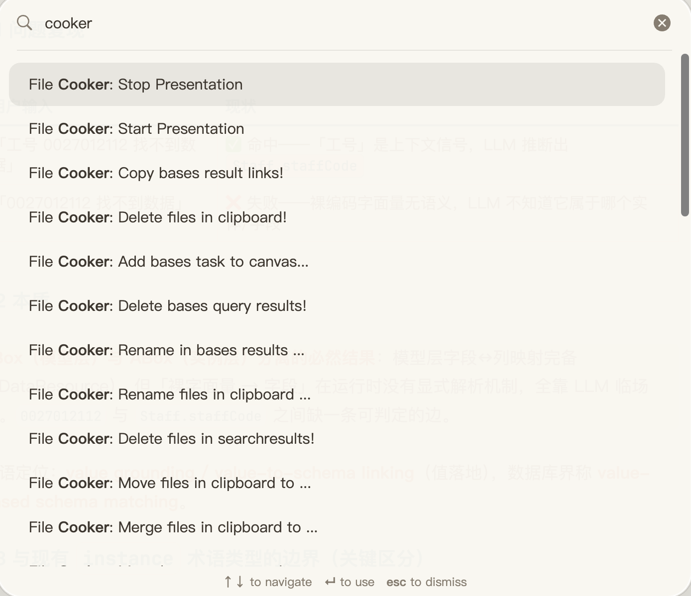

> Cook your notes like a chef: pick the ingredients, fire the pan, confirm before it's served ✅
>
> [中文文档](README_zh.md)

# File Cooker

File Cooker is an Obsidian plugin for **batch file operations**. Treat a batch of files (from search results, clipboard, current file links, Dataview / Bases queries …) as ingredients, then run a single command to **move, rename, edit properties, delete, merge, sync to flomo, or add to Canvas** — like cooking them in one pan.

- 🧺 **Any source**: clipboard · current file · search results · Dataview query · Bases query · context menu
- 🍳 **Rich operations**: move / rename / edit properties / delete / merge / create / sync to flomo / copy links / add to Canvas
- 🛡️ **Confirm before acting**: every operation shows a confirmation modal; destructive ones (delete) are highlighted in red
- 📱 **Mobile friendly**: not desktop-only (`isDesktopOnly: false`)

---

## ✨ Features

- **Batch edit properties**: add / modify / delete frontmatter properties; `tags` / `alias` / `cssclasses` support comma-separated multi-value edits and `-` prefix to remove a single value; **no MetaEdit plugin needed** (built-in since v1.8.0)
- **Batch move / rename**: organize selected files into a target folder or rename them in one go
- **Batch merge**: merge multiple files into one target file (YAML ignored)
- **Batch create**: materialize **unresolved links** of the current file into real files
- **Sync to flomo**: sync file links, file content, or current selection (requires flomoAPI)
- **Copy links**: copy Dataview / Bases result links to the clipboard
- **Add to Canvas**: batch-add files, text / selection, or Dataview tasks into a target canvas
- ⭐ **Bases integration** (new in v2.0.0): run file operations directly on Bases query results
- ⭐ **Context menu** (new in v2.0.0): right-click access from editor and file explorer
- **Presentation mode** (new in v1.9.0): one-click larger font and wider editor for screen sharing

## 📸 Screenshot

> Demo: search results + clipboard + Dataview query — all sources share the same "Select → Cook → Confirm" flow.

## 🍳 How it works: Select → Cook → Confirm

1. **Select**: pick a batch of files from any supported source
2. **Cook**: run the matching operation command
3. **Confirm**: review the targets in the confirmation modal, then execute

### Supported input sources

| Source | How to use | Notes |
| :--- | :--- | :--- |
| 📋 Clipboard | Copy file links (e.g. search results) first, then run clipboard commands | Plain text content can also be added to Canvas |
| 📄 Current file | Open a file, then run current-file-link commands | Reads links / unresolved links / content / selection |
| 🔍 Search results | Open the Obsidian search panel, then run search results commands | Operates directly on the results in the panel |
| 📊 Dataview query | Select a DQL or DataviewJS query in the editor, then run Dataview commands | Requires the [Dataview](https://github.com/blacksmithgu/obsidian-dataview) plugin; DataviewJS supported since v1.7.1 |
| 🗄️ Bases query | Open a Bases view, then run Bases commands | New in v2.0.0; only rows mappable to real files are processed |
| 🖱️ Context menu | Right-click in the editor or file explorer | New in v2.0.0 |

### Supported operations

| Operation | Example command | Notes |
| :--- | :--- | :--- |
| 📁 Move | Move ... to folder | Batch move to a target folder |
| ✏️ Rename | Rename ... | Batch rename |
| 🏷️ Edit properties | Edit Properties ... | Add / modify / delete frontmatter, multi-value supported |
| 🗑️ Delete | Delete ... ! | Destructive — highlighted red in the confirmation modal |
| 🔗 Merge | Merge ... to ... | Merge into a target file |
| 🆕 Create | Create links ... | Create files from unresolved links |
| 📤 Sync to flomo | Sync ... to flomo | File links / content / selection |
| 📋 Copy links | Copy ... links! | Copy result links to the clipboard |
| 🖼️ Add to Canvas | Add ... to canvas | Files / text / tasks |

### Bases integration (new in v2.0.0)

When a Bases data source is available, File Cooker provides a Bases command group aligned with the Dataview file commands (move / rename / edit properties / delete / merge / sync to flomo / copy links / add to canvas / add task).

Behavior boundaries:

- **File-only mapping**: only rows that can be mapped to real vault files are processed
- **Ignore non-file rows**: unmapped rows are skipped, and a notice reports the ignored count
- **No row writes**: File Cooker does **not** modify Bases row fields in this flow

### Context menu (new in v2.0.0)

- **Editor context menu**:
  - `File Cooker > Selection`: sync the selection to flomo / add it to a canvas (only when a selection exists)
  - `File Cooker > Current file links`: run link-based batch operations from the current file
- **File explorer context menu**:
  - `File Cooker > Target file`: rename / edit properties / delete the right-clicked file

> Notes: destructive actions (like delete) still require confirmation. If no active file exists, current-file-link operations are safely blocked with a notice.

## ⚙️ Settings

| Setting | Purpose | Default |
| :--- | :--- | :--- |
| Limit | Maximum number of files processed per batch | `300` |
| flomoAPI | flomo API endpoint, used to sync notes to flomo | empty |

> flomo sync commands will notify "Please config flomoAPI first!" when the API is not configured.

## 📦 Installation

### Method 1: Community plugins (recommended)

1. Settings → Third-party plugin → **turn off Safe mode**
2. Click **Browse**, search for **File Cooker**
3. Click **Install**, then **enable** the plugin

### Method 2: Manual installation

1. Download the [latest release](https://github.com/ivaneye/obsidian-files-cooker/releases/latest)
2. Extract the `obsidian-file-cooker` folder into `<vault>/.obsidian/plugins/`
   > Note: on some machines the `.obsidian` folder is hidden. On macOS press `Command+Shift+Dot` to reveal it.
3. Reload Obsidian and enable the plugin in Settings

### Requirements

- Obsidian ≥ **1.12.3** (since v2.0.0)
- **Dataview** plugin: only needed for the "Dataview query" source
- **flomoAPI**: only needed for "Sync to flomo" commands
- Everything else works out of the box with no extra dependencies

## 🛡️ Safety & limits

- **Always confirm**: every command opens a confirmation modal before any change is made
- **Delete is highlighted**: delete commands are marked in red in the confirmation modal
- **Batch limit**: a single batch is limited to 300 files by default (adjustable in Settings)
- **Visible failures**: no files, no active file, missing config, etc. are always reported via Notice — never silently

## 💬 Feedback & support

Questions or suggestions? Feel free to **add me on WeChat: `IvyOdds`**, or open an issue on [GitHub Issues](https://github.com/ivaneye/obsidian-files-cooker/issues).

If File Cooker helps you, please share it with your Obsidian friends 🙏

## 📜 License

- MIT License — see [LICENSE](./LICENSE)
- Issues and pull requests are welcome

## 📝 Changelog

### 2.0.0

- New **Bases query** source for batch file operations (file-only rows; no Bases field writes)
- New **context menu** entries (editor: selection / current file links; file explorer: target file)
- Upgraded Obsidian dependency to 1.12.3

### 1.9.0

- New **presentation mode**: one-click larger font and wider editor for screen sharing

### 1.8.1

- Multi-value property editing: `tags` / `alias` / `cssclasses` batch add/remove via comma-separated values

### 1.8.0

- Built-in **batch property editing** — no MetaEdit plugin required

### 1.7.8

- New **search results** commands, operate directly on the search panel results

### 1.7.7

- Add **Dataview tasks** to Canvas

### 1.7.6

- Add **text** to Canvas

### 1.7.1

- Support **DataviewJS** page queries

### 1.7.0

- Batch-add **files** to Canvas

### 1.0 ~ 1.6

- Core capabilities: move, rename, merge, delete, create from unresolved links, sync to flomo, copy links

---

## ☕ Buy me a coffee

  
  
  

