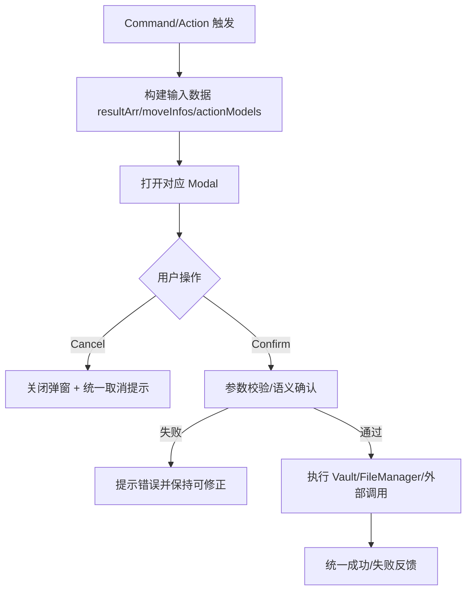

## Context

当前插件内存在多个业务弹窗（删除、移动/复制、创建、重命名、属性编辑、合并、同步 flomo 等），均以独立类直接拼装 UI。现状问题包括：
- 信息层级不一致：多数弹窗仅展示标题+路径列表，缺少“操作摘要”与空态规范。
- 操作语义不一致：取消按钮普遍与确认按钮同级强调，高风险操作缺少明确危险语义。
- 可读性不足：批量文件路径直接平铺，缺少滚动容器与数量提示，长列表场景认知负担高。
- 样式不可复用：`styles.css` 几乎为空，导致弹窗体验依赖各类中零散实现。

约束条件：
- 采用“原生增强”方向，优先保持 Obsidian 主题兼容与交互习惯。
- 本次不引入新业务能力，仅统一现有弹窗体验与行为约束。
- 变更覆盖多个模块（`src/modal/*`、相关 command/action、测试用例），属于跨模块改造。

相关方：
- 终端用户：批量操作时的可读性、可预期性与误操作风险。
- 维护者：后续新增弹窗时的一致性与实现成本。

## Goals / Non-Goals

**Goals:**
- 统一所有现有业务弹窗的结构骨架（标题/说明/摘要/列表/操作区）。
- 统一按钮语义：确认为主操作，取消为次操作，删除等高风险操作采用危险语义。
- 统一反馈规范：空态、成功、取消、输入校验提示文案风格一致。
- 提供可复用样式与构建约定，避免后续弹窗风格漂移。
- 通过自动化测试覆盖核心交互分支，采用 TDD 落地行为变更。

**Non-Goals:**
- 不新增任何文件处理业务功能。
- 不重构命令系统、读取器（reader）或动作执行核心逻辑。
- 不引入第三方 UI 组件库。

## Decisions

### 决策 1：建立统一弹窗交互骨架并应用到全部业务弹窗
- 方案：所有确认/输入类弹窗统一为 Header（标题+说明）/ Summary（数量与目标）/ Content（可滚动列表或表单）/ Actions（取消+确认）。
- 原因：先统一信息架构可在最小业务风险下显著提升可用性。
- 备选方案：
  - 仅逐个美化 CSS：无法解决语义和信息层级问题，收益有限。
  - 全量重写为抽象基类：一次性改动过大，回归风险高。

### 决策 2：建立操作语义标准并强制危险操作区分
- 方案：
  - 主确认按钮使用高强调样式。
  - 取消按钮降级为次要样式。
  - 删除等高风险操作使用危险文案与危险样式。
- 原因：降低误触概率，提高用户对后果的预判能力。
- 备选方案：维持当前全部 `setCta()` 风格；缺点是主次不分、风险提示弱。

### 决策 3：为批量文件展示引入摘要与滚动策略
- 方案：
  - 在摘要区显示“将处理 N 个文件”“目标路径/模式”等关键上下文。
  - 列表区域限制高度并滚动，避免弹窗过高导致操作区不可见。
- 原因：批量场景是主要痛点，摘要+滚动是性价比最高的改造。
- 备选方案：仅展示前若干条并折叠剩余；缺点是用户无法完整核对。

### 决策 4：样式采用“原生增强”并集中维护
- 方案：在 `styles.css` 中增加可复用 modal class 规范，优先使用 Obsidian 变量与语义色。
- 原因：提升一致性并降低主题兼容风险。
- 备选方案：为每个弹窗写私有样式；缺点是重复与漂移不可控。

### 决策 5：测试策略采用 TDD，覆盖关键交互分支
- 测试层次：以现有测试体系中的单元/回归测试为主，验证弹窗行为结果与提示文案。
- 组织方式：按弹窗类别（危险确认、普通确认、输入型）组织测试用例。
- Mock/Stub 策略：复用 `tests/mocks/obsidian.ts` 对 Modal、Notice、Vault/FileManager 行为进行可控替身。
- 关键用例：
  - 确认/取消分支行为正确。
  - 空数据场景显示空态并可安全关闭。
  - 删除类操作具备危险语义且仅在确认后执行。
  - 输入校验失败时阻断执行并给出统一提示。

### 模块交互与调用链（Mermaid）

## Risks / Trade-offs

- [风险] 全量弹窗同时改造导致回归面大  
  → [缓解] 按“危险确认类→普通确认类→输入类”分批提交，并在每批完成后执行测试回归。

- [风险] 自定义样式与主题变量不匹配导致深浅色模式可读性问题  
  → [缓解] 优先使用 Obsidian 变量，补充浅色/深色双场景人工校验清单。

- [权衡] 不进行一次性抽象基类重构，短期会保留少量重复代码  
  → [缓解] 本次先统一行为与样式规范，后续可在稳定后再做结构性抽象。

## Migration Plan

- 部署策略：以一次功能发布包含全部弹窗 UX 改造，不涉及数据迁移。
- 回滚策略：若出现严重回归，整体回退至变更前版本（代码级回滚）。
- 兼容性：不变更外部配置项与数据结构，用户无需迁移操作。

## Open Questions

- 是否需要在本次同步统一所有 Notice 文案的中英文风格（例如全部中文化）？
- 文件路径展示是否需要加入“仅显示文件名 + hover 展示完整路径”的进一步优化（可作为后续增量）？
